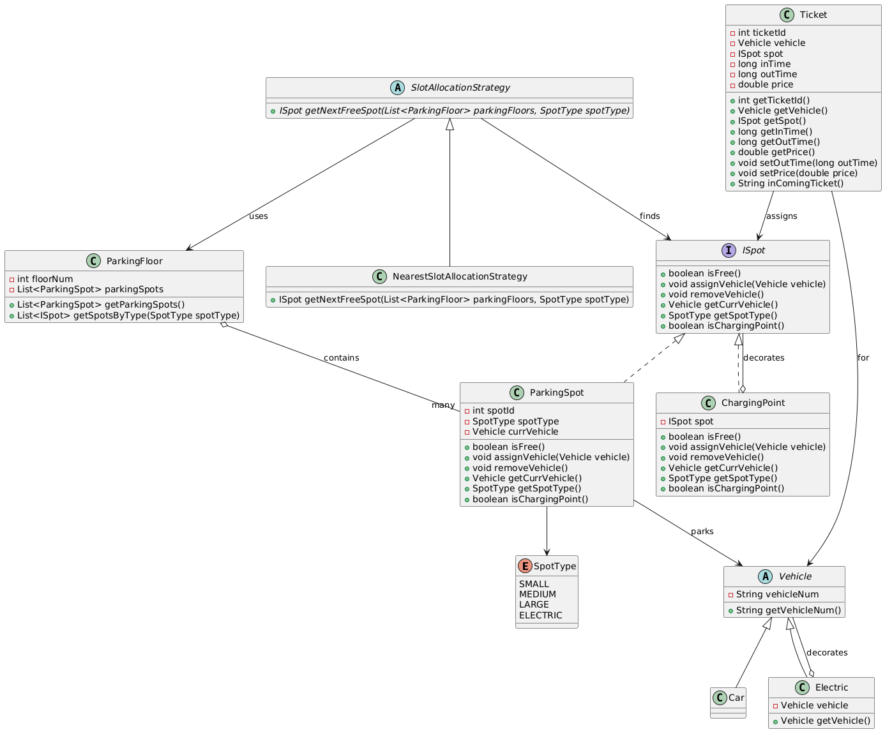

# Parking Lot Management System

This project implements a parking lot management system with various features like different spot types, charging points for electric vehicles, and a flexible spot allocation strategy.

## Class Diagram

To view the class diagram:

1. The diagram is defined in `parking_lot_diagram.puml`
2. You can generate the PNG image from the PlantUML file using:
   - Online tools like [PlantUML Web Server](https://www.plantuml.com/plantuml/uml/)
   - Command line: `java -jar plantuml.jar parking_lot_diagram.puml` (requires PlantUML jar)
   - IDE plugins for VS Code, IntelliJ, etc.

## System Components

### Spot Types
- `SMALL`, `MEDIUM`, `LARGE`, `ELECTRIC`

### Key Interfaces and Classes
- `ISpot` - Interface for all types of parking spots
- `Vehicle` - Base class for all vehicle types
- `SlotAllocationStrategy` - Abstract class for different allocation algorithms
- `ParkingFloor` - Manages a collection of parking spots
- `ParkingSpot` - Implementation of a standard parking spot
- `ChargingPoint` - Decorator that adds charging capabilities to a spot
- `Ticket` - Manages parking information

### Design Patterns Used
- **Decorator Pattern** - `ChargingPoint` decorates `ISpot`
- **Strategy Pattern** - `SlotAllocationStrategy` for different allocation strategies

## How to Use

To park a vehicle:
1. Create a vehicle instance (Car, Electric, etc.)
2. Use a slot allocation strategy to find an available spot
3. Create a ticket associating the vehicle with the spot

To retrieve a vehicle:
1. Find the ticket
2. Remove the vehicle from the associated spot
3. Calculate and set the price based on parking duration
